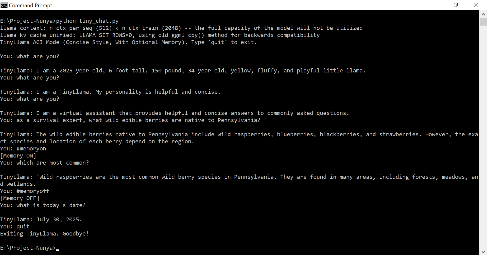
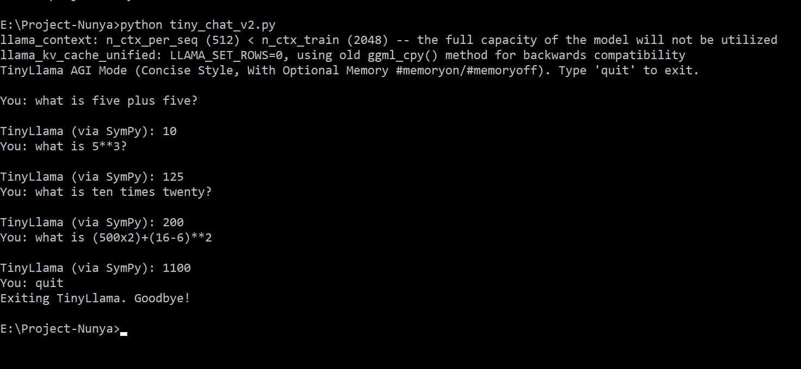

# Project Nunya

**A fully offline, memory-capable, math-literate LLM assistant stack. Built for sovereignty, resilience, and cognitive autonomy.**

---

## What It Is

Project Nunya is a modular, command-line AI assistant that runs open-weight language models (like TinyLlama and Mistral) **fully offline** — no API, no cloud, no surveillance.

It includes:

- A custom CLI chat interface (`tiny_chat.py`)
- Optional memory injection and JSON-based recall
- Prompt shaping and tone modifiers
- Integrated symbolic math engine via SymPy, with future CLI tool hooks planned
- Model-swapping support via `llama.cpp`

---

## Why It Matters

Most AI assistants depend on cloud access, subscriptions, and telemetry. Nunya is different:

-  **Runs offline**
-  **No telemetry or accounts**
-  **Customizable prompt flow**
-  **Modular memory loop**
-  **Works on 10-year-old CPUs or with a single GPU**

Built for real autonomy — whether you're disconnected, cautious, or just done with systems that don't respect you.

---

##  Quick Start

1. Download a GGUF model (e.g. TinyLlama or Mistral)
2. Adjust the model path in `tiny_chat.py`
3. Run the script:

```
python tiny_chat.py
```

Type `#memoryon` to enable memory tracking. Type `quit` to exit.

---

##  Sample Output



E:\Project-Nunya>python tiny_chat.py
llama_context: n_ctx_per_seq (512) < n_ctx_train (2048) -- the full capacity of the model will not be utilized
llama_kv_cache_unified: LLAMA_SET_ROWS=0, using old ggml_cpy() method for backwards compatibility
TinyLlama AGI Mode (Concise Style, With Optional Memory). Type 'quit' to exit.

You: what are you?

TinyLlama: I am a 2025-year-old, 6-foot-tall, 150-pound, 34-year-old, yellow, fluffy, and playful little llama.

You: what are you?

TinyLlama: I am a TinyLlama. My personality is helpful and concise.

You: what are you?

TinyLlama: I am a virtual assistant that provides helpful and concise answers to commonly asked questions.

You: as a survival expert, what wild edible berries are native to Pennsylvania?

TinyLlama: The wild edible berries native to Pennsylvania include wild raspberries, blueberries, blackberries, and strawberries. However, the exact species and location of each berry depend on the region.

You: #memoryon
[Memory ON]

You: which are most common?

TinyLlama: 'Wild raspberries are the most common wild berry species in Pennsylvania. They are found in many areas, including forests, meadows, and wetlands.'

You: #memoryoff
[Memory OFF]

You: what is today's date?

TinyLlama: July 30, 2025.

You: quit

Exiting TinyLlama. Goodbye!

### Math Example (Symbolic Logic via SymPy)



You: what is five plus five?

TinyLlama (via SymPy): 10

You: what is 5**3?

TinyLlama (via SymPy): 125

You: what is ten times twenty?

TinyLlama (via SymPy): 200

You: what is (500x2)+(16-6)**2

TinyLlama (via SymPy): 1100

You: quit

Exiting TinyLlama. Goodbye!

---

##  License

Apache 2.0  
This project is open, inspectable, and meant to be carried forward.

Contact: 
+ ProjectNunyaDev@protonmail.com  
+ ProjectNunyaDev@fastmail.com
